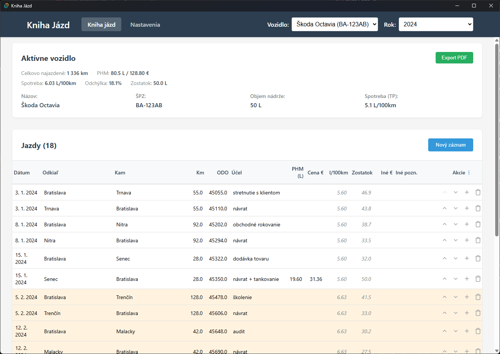

[English](README.en.md) | **Slovensky**

# Kniha Jázd

Desktopová aplikácia na evidenciu jázd služobných vozidiel pre SZČO a malé firmy.
Automaticky počíta spotrebu, sleduje 20% limit nadpotreby a pomáha s daňovou evidenciou.



## Funkcie

- **Evidencia jázd** - Záznam dátumu, trasy, km a účelu jazdy
- **Automatický výpočet spotreby** - l/100km sa vypočíta automaticky pri tankovaní
- **Sledovanie zostatku paliva** - Zostatok v nádrži po každej jazde
- **20% limit nadpotreby** - Upozornenie pri prekročení zákonného limitu
- **Návrhy kompenzačných jázd** - Ako sa dostať späť pod limit
- **Pamätanie trás** - Časté trasy sa automaticky dopĺňajú
- **Ročné prehľady** - Každý rok = samostatná kniha jázd
- **Zálohovanie a obnova** - Jednoduchá správa databázy
- **Export** - HTML náhľad s tlačou do PDF (Ctrl+P)
- **Doklady (AI OCR)** - Automatické rozpoznávanie blokov z čerpacích staníc

## Inštalácia

Stiahnite si najnovšiu verziu pre váš systém z [Releases](../../releases):

| Systém | Súbor |
|--------|-------|
| Windows | `Kniha-Jazd_x.x.x_x64-setup.msi` |
| macOS (Apple Silicon) | `Kniha-Jazd_x.x.x_aarch64.dmg` |
| macOS (Intel) | `Kniha-Jazd_x.x.x_x64.dmg` |

## Použitie

### 1. Pridanie vozidla

V nastaveniach pridajte vozidlo so zadaním:
- Názov a ŠPZ
- Objem nádrže (litre)
- Spotreba podľa TP (l/100km)
- Počiatočný stav tachometra

### 2. Záznam jazdy

Pre každú jazdu zadajte:
- Dátum
- Odkiaľ - Kam
- Počet km (alebo sa vypočíta z ODO)
- Účel jazdy

### 3. Tankovanie

Pri tankovaní zadajte:
- Počet natankovaných litrov
- Cenu (voliteľné)
- Či išlo o plnú nádrž

Aplikácia vypočíta spotrebu automaticky.

### 4. Sledovanie limitu

- Margin pod 20% = v poriadku
- Margin nad 20% = upozornenie + návrhy kompenzačných jázd

### 5. Doklady (AI rozpoznávanie blokov)

Aplikácia podporuje automatické rozpoznávanie blokov z čerpacích staníc pomocou AI (Gemini).

#### Nastavenie

1. **Získajte Gemini API kľúč:**
   - Navštívte [Google AI Studio](https://aistudio.google.com/apikey)
   - Vytvorte nový API kľúč (bezplatný tier stačí pre bežné použitie)

2. **Vytvorte konfiguračný súbor** `local.settings.json`:

   - Windows: `%APPDATA%\com.notavailable.kniha-jazd\local.settings.json`
   - macOS: `~/Library/Application Support/com.notavailable.kniha-jazd/local.settings.json`

   ```json
   {
     "gemini_api_key": "AIza...",
     "receipts_folder_path": "C:\\Cesta\\K\\Blokom"
   }
   ```

   > **Tip:** Na Windows môžete otvoriť priečinok príkazom `Win+R` → `%APPDATA%\com.notavailable.kniha-jazd`

#### Štruktúra priečinka s bločkami

Aplikácia podporuje dva spôsoby organizácie bločkov:

**Plochá štruktúra** - všetky súbory priamo v priečinku:
```
/bloky/
  blocok1.jpg
  blocok2.png
```
→ Bločky sa zobrazujú vo všetkých rokoch

**Ročná štruktúra** - súbory v podpriečinkoch podľa roku:
```
/bloky/
  2024/
    blocok1.jpg
  2025/
    blocok2.png
```
→ Bločky sa filtrujú podľa vybraného roku

**Poznámky:**
- Miešaná štruktúra (súbory + priečinky) zobrazí upozornenie a bločky sa nenačítajú
- Dátum z OCR má prednosť pred rokom priečinka (pomáha odhaliť nesprávne zaradené bločky)

#### Použitie

1. Uložte fotky blokov do nastaveného priečinka
2. Otvorte sekciu "Doklady" a kliknite na "Sync"
3. AI rozpozná dátum, litre a sumu
4. Priraďte bloky k jazdám

## Často kladené otázky (FAQ)

**Kde sú uložené moje dáta?**
Všetky dáta sú uložené lokálne v SQLite databáze:
- Windows: `%APPDATA%\com.notavailable.kniha-jazd\kniha-jazd.db`
- macOS: `~/Library/Application Support/com.notavailable.kniha-jazd/kniha-jazd.db`

**Zostatok paliva ukazuje zápornú hodnotu?**
Zostatok sa počíta z natankovaných litrov mínus spotreba. Ak je záporný, skontrolujte:
- Či ste zadali správny počet km
- Či ste zaznamenali všetky tankovania

**Rozpoznávanie blokov nefunguje?**
1. Skontrolujte, či máte správny Gemini API kľúč v `local.settings.json`
2. Overte, že priečinok s bločkami existuje
3. Podporované formáty: JPG, PNG, WebP, PDF

**Ako preniesť dáta na nový počítač?**
1. V nastaveniach vytvorte zálohu
2. Skopírujte súbor `.backup` na nový počítač
3. V nastaveniach obnovte zo zálohy

## Súkromie

Všetky dáta zostávajú na vašom počítači. Jediné externé pripojenie je pri použití AI rozpoznávania blokov - vtedy sa obrázky posielajú do Gemini API (Google). Túto funkciu nemusíte používať.

## Pre vývojárov

Pozrite [README.en.md](README.en.md) pre dokumentáciu v angličtine.

### Technológie

- **Frontend:** SvelteKit + TypeScript
- **Backend:** Tauri (Rust)
- **Databáza:** SQLite

Pre detailnú architektúru pozrite [ARCHITECTURE.md](ARCHITECTURE.md) (v angličtine).

### Lokálne spustenie

```bash
npm install
npm run tauri dev
```

### Testy

```bash
cd src-tauri && cargo test
```

## Licencia

[GPL-3.0](LICENSE)

## Prispievanie

Pozrite [CONTRIBUTING.md](CONTRIBUTING.md) (v angličtine).
