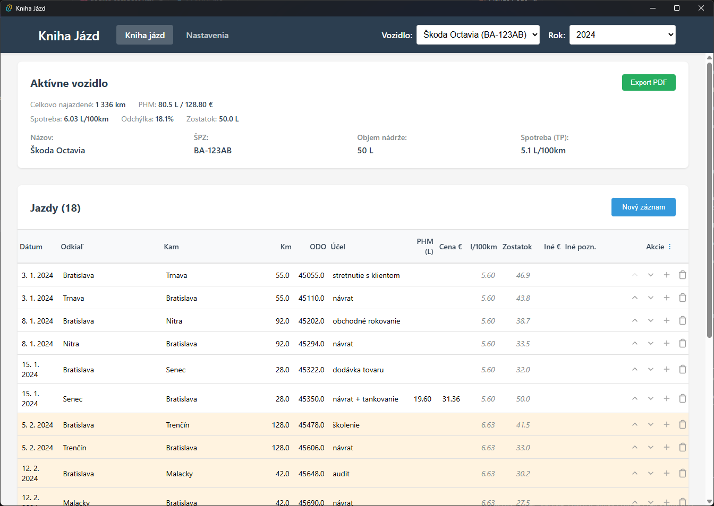

[English](README.en.md) | **Slovensky**

[](https://github.com/mcsdodo/kniha-jazd/actions/workflows/test.yml)

# Kniha Jázd

Aplikácia na evidenciu jázd služobných vozidiel pre SZČO a malé firmy.
Automaticky počíta spotrebu, sleduje 20% limit nadpotreby a pomáha s daňovou evidenciou.

Beží ako Docker kontajner na vašom serveri (NAS, Raspberry Pi, homelab) a ovládate ju
z prehliadača na ktoromkoľvek zariadení v lokálnej sieti. Desktopová verzia už nie je
udržiavaná — nainštalované kópie zostávajú funkčné, ale nedostanú ďalšie aktualizácie.



## Funkcie

- **Evidencia jázd** - Záznam dátumu/času, trasy, km a účelu jazdy
- **Zákonná zhoda (od 1.1.2026)** - Poradové číslo jazdy, meno vodiča, čas ukončenia, km pred jazdou, riadky konca mesiaca
- **Automatický výpočet spotreby** - l/100km sa vypočíta automaticky pri tankovaní
- **Sledovanie zostatku paliva** - Zostatok v nádrži po každej jazde
- **20% limit nadpotreby** - Upozornenie pri prekročení zákonného limitu
- **Návrhy kompenzačných jázd** - Ako sa dostať späť pod limit
- **Návrh tankovania** - Automatický výpočet litrov pre dosiahnutie optimálnej spotreby
- **Pamätanie trás** - Časté trasy sa automaticky dopĺňajú
- **Ročné prehľady** - Každý rok = samostatná kniha jázd
- **Skrývateľné stĺpce** - Prispôsobenie tabuľky jázd podľa potreby
- **Zálohovanie a obnova** - Automatická záloha pred migráciou databázy, správa záloh
- **Export** - HTML náhľad s tlačou do PDF (Ctrl+P), rešpektuje skryté stĺpce
- **Doklady (AI OCR)** - Automatické rozpoznávanie blokov z čerpacích staníc s podporou viacerých mien (EUR, CZK, HUF, PLN)
- **Home Assistant integrácia** - Zobrazenie ODO a hladiny paliva z HA, odosielanie návrhu tankovania do HA senzora
- **Prístup z prehliadača** - Telefón, tablet aj počítač pristupujú k tej istej inštancii v lokálnej sieti
- **Docker nasadenie** - Jeden kontajner, jeden `/data` zväzok, pre vždy-zapnuté zariadenia (NAS, Raspberry Pi). Detaily nájdete v [docs/features/server-mode.md](docs/features/server-mode.md).

## Inštalácia

Aplikácia sa distribuuje ako Docker image. Žiadne inštalátory sa už nezverejňujú.

```bash
mkdir -p data
docker run -d --name kniha-jazd \
  -p 3456:3456 \
  -v "$PWD/data:/data" \
  --restart unless-stopped \
  ghcr.io/mcsdodo/kniha-jazd-web:latest
```

Aplikácia beží na `http://<ip-servera>:3456`.

Ak si chcete image zostaviť sami zo zdrojov, [docker-compose.web.yml](docker-compose.web.yml)
robi build z [Dockerfile.web](Dockerfile.web):

```bash
docker compose -f docker-compose.web.yml up -d
```

Aktualizácia = stiahnutie nového tagu (`ghcr.io/mcsdodo/kniha-jazd-web:vX.Y.Z`) a reštart
kontajnera. Databáza v `/data` zostáva, migrácie sa spustia automaticky pri štarte.

## Použitie

### 1. Pridanie vozidla

V nastaveniach pridajte vozidlo so zadaním:
- Názov a ŠPZ
- Objem nádrže (litre)
- Spotreba podľa TP (l/100km)
- Počiatočný stav tachometra

### 2. Záznam jazdy

Pre každú jazdu zadajte:
- Dátum a čas začiatku/konca
- Odkiaľ - Kam
- Počet km (alebo sa vypočíta z ODO)
- Účel jazdy

### 3. Tankovanie

Pri tankovaní zadajte:
- Počet natankovaných litrov
- Cenu (voliteľné)
- Či išlo o plnú nádrž

Aplikácia vypočíta spotrebu automaticky.

### 4. Sledovanie limitu

- Margin pod 20% = v poriadku
- Margin nad 20% = upozornenie + návrhy kompenzačných jázd

### 5. Doklady (AI rozpoznávanie blokov)

Aplikácia podporuje automatické rozpoznávanie blokov z čerpacích staníc pomocou AI (Gemini).
Podporované meny: EUR, CZK, HUF, PLN (cudzie meny vyžadujú manuálnu konverziu na EUR).

#### Nastavenie

1. **Získajte Gemini API kľúč:**
   - Navštívte [Google AI Studio](https://aistudio.google.com/apikey)
   - Vytvorte nový API kľúč (bezplatný tier stačí pre bežné použitie)

2. **Nastavte v aplikácii** v časti Nastavenia → Skenovanie dokladov:
   - Zadajte Gemini API kľúč
   - Vyberte priečinok s bločkami

   > **Alternatíva:** Premenná prostredia `GEMINI_API_KEY` na kontajneri (má prednosť pred
   > uloženým nastavením), alebo manuálna konfigurácia v `local.settings.json` v dátovom
   > priečinku (`/data/local.settings.json` v kontajneri):
   > ```json
   > {
   >   "gemini_api_key": "AIza...",
   >   "receipts_folder_path": "/data/receipts"
   > }
   > ```

   Priečinok s bločkami je cesta **na serveri** (v kontajneri), nie na vašom počítači —
   zadajte ju ako text, napr. `/data/receipts`, a namontujte ju do kontajnera.

#### Štruktúra priečinka s bločkami

Aplikácia podporuje dva spôsoby organizácie bločkov:

**Plochá štruktúra** - všetky súbory priamo v priečinku:
```
/bloky/
  blocok1.jpg
  blocok2.png
```
→ Bločky sa zobrazujú vo všetkých rokoch

**Ročná štruktúra** - súbory v podpriečinkoch podľa roku:
```
/bloky/
  2024/
    blocok1.jpg
  2025/
    blocok2.png
```
→ Bločky sa filtrujú podľa vybraného roku

**Poznámky:**
- Miešaná štruktúra (súbory + priečinky) zobrazí upozornenie a bločky sa nenačítajú
- Dátum z OCR má prednosť pred rokom priečinka (pomáha odhaliť nesprávne zaradené bločky)

#### Použitie

1. Uložte fotky blokov do nastaveného priečinka
2. Otvorte sekciu "Doklady" a kliknite na "Sync"
3. AI rozpozná dátum, litre a sumu
4. Priraďte bloky k jazdám

## Často kladené otázky (FAQ)

**Kde sú uložené moje dáta?**
V SQLite databáze na `/data` zväzku kontajnera — pri bežnom nasadení je to priečinok
`./data` na hostiteľovi:
- Databáza: `/data/kniha-jazd.db`
- Zálohy: `/data/backups/`
- Nastavenia: `/data/local.settings.json`

**Zostatok paliva ukazuje zápornú hodnotu?**
Zostatok sa počíta z natankovaných litrov mínus spotreba. Ak je záporný, skontrolujte:
- Či ste zadali správny počet km
- Či ste zaznamenali všetky tankovania

**Rozpoznávanie blokov nefunguje?**
1. Skontrolujte Gemini API kľúč (premenná `GEMINI_API_KEY` alebo `local.settings.json`)
2. Overte, že priečinok s bločkami existuje **vnútri kontajnera**
3. Podporované formáty: JPG, PNG, WebP, PDF

**Ako preniesť dáta na iný server?**

*Cez priečinok:* zastavte kontajner a skopírujte celý `./data` priečinok. Obsahuje
databázu, zálohy aj nastavenia.

*Cez zálohu:*
1. V nastaveniach vytvorte zálohu
2. Skopírujte súbor `.backup` do `data/backups/` na novom serveri
3. V nastaveniach obnovte zo zálohy

Databázu otvára práve jedna inštancia — nespravujte ten istý `/data` priečinok
z dvoch kontajnerov naraz.

## Súkromie

Všetky dáta zostávajú na vašom serveri. Server nemá autentifikáciu a je určený výlučne pre dôveryhodnú lokálnu sieť (CORS povoľuje len privátne IP rozsahy) — nevystavujte ho do internetu. Jediné externé pripojenie je pri použití AI rozpoznávania blokov - vtedy sa obrázky posielajú do Gemini API (Google). Túto funkciu nemusíte používať.

## Pre vývojárov

Pozrite [README.en.md](README.en.md) pre dokumentáciu v angličtine.

### Technológie

- **Frontend:** SvelteKit + TypeScript (statická SPA)
- **Backend:** Rust — `kniha-jazd-core` (logika) + `kniha-jazd-web` (Axum HTTP server)
- **Databáza:** SQLite
- **Nasadenie:** Docker image `ghcr.io/mcsdodo/kniha-jazd-web`

Pre detailnú architektúru pozrite [ARCHITECTURE.md](ARCHITECTURE.md) (v angličtine).

Pre dokumentáciu jednotlivých funkcií pozrite [docs/features/](docs/features/) (v angličtine).

### Lokálne spustenie

#### macOS: Inštalácia Rust

Pred lokálnym spustením na macOS je potrebné nainštalovať Rust:

```bash
# Inštalácia Rust (oficiálna metóda pre macOS)
curl --proto '=https' --tlsv1.2 -sSf https://sh.rustup.rs | sh

# Po inštalácii reštartujte terminál alebo spustite:
source "$HOME/.cargo/env"

# Overenie:
cargo --version
```

#### Spustenie aplikácie

Dva procesy v dvoch termináloch:

```bash
npm install

# 1) backend na porte 3456 (STATIC_DIR nechajte nenastavený — SPA servuje vite)
cargo run --manifest-path src-tauri/Cargo.toml -p kniha-jazd-web

# 2) frontend na porte 5173, /api proxuje na localhost:3456
npm run dev
```

### Testy

```bash
npm run test:backend      # Rust testy (celý workspace)

# Integračné testy potrebujú zostavenú SPA a debug binárku
npm run build
cargo build --manifest-path src-tauri/Cargo.toml -p kniha-jazd-web
npm run test:integration
```

### Zostavenie

```bash
docker build -f Dockerfile.web -t kniha-jazd-web:local .
```

## Licencia

[GPL-3.0](LICENSE)

## Prispievanie

Pozrite [CONTRIBUTING.md](CONTRIBUTING.md) (v angličtine).
